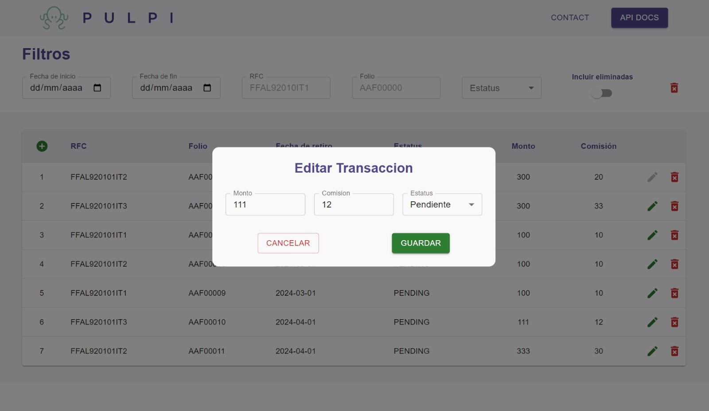

# Technical Assessment for Pulpi - Repository Overview

Welcome to the repository containing the Frontend and Backend projects for the technical assessment by Pulpi. This comprehensive repository is structured to include distinct directories for each segment of the application, allowing for clear separation of concerns and streamlined project management.

In the following sections, you will find detailed documentation for both the Frontend and Backend parts of the project. Each section aims to provide a clear understanding of the architecture, setup, and functionality encapsulated within the respective codebases.

Scroll down to explore the intricacies of each project and gain insights into the development process and decisions made throughout the creation of the application.

### [Frontend Documentation](#frontend-structure-overview) - [Backend Documentation](#backend-structure-overview)

***

## Postman Collection for API Testing
For convenience and to facilitate testing of the API, a Postman collection has been provided. This collection includes predefined requests for all the available endpoints, making it easier to test and interact with the API.

You can find the Postman collection file at `./pulpi.postman_collection.json` within the repository. To use it, simply import this file into Postman.

### Importing the Collection into Postman
1. Open Postman.
2. Click on the `Import` button located at the top left corner of the Postman interface.
3. Choose the `File` tab in the dialog that appears.
4. Click on the `Upload Files` button and navigate to the location of `pulpi.postman_collection.json`.
5. Select the file and click `Open` to import the collection into Postman.

After importing, you will have access to all the configured requests and can start testing the API immediately.

***

## Running the Projects

To get both the Frontend and Backend up and running, you'll need to install their respective dependencies and start their development servers. Follow the steps below for each project:

### In both proyects are the same steps 
1. Navigate to the backend or frontend project directory:

   ```sh
   cd back/
   ```
   or
   ```sh
   cd front/
   ```
2. Install the necessary dependencies:
   ```sh
   npm install
   ```
3. Start the development server
   ```sh
   npm run dev
   ```
> Make sure both development servers are running to enable proper communication between the frontend and backend services.

> **Important:** Before running the backend project, ensure that you have the MySQL service running on your local machine. Additionally, you must have a schema named `pulpi` created within your MySQL instance. The backend is configured to automatically generate the necessary tables within this schema upon launch.

***
# Frontend Structure Overview

## Introduction

This is the frontend counterpart of the backend project previously outlined. The frontend is crafted with React, leveraging the power of SCSS modules for styling and Material-UI components for a polished interface. This document details the structure and methodologies adopted throughout the development process.

### Development Process Overview

#### Analyzing Views

The development kicked off with an analysis of the required views, delineating the visual aspects and user interaction points crucial for a coherent user experience.

#### Component Analysis

Following the view analysis, I deconstructed the interface into reusable components. This modular approach facilitates maintainability and promotes a DRY (Don't Repeat Yourself) coding standard.

#### Hooks and HOC Implementation

For state management and side effects, custom hooks were implemented, including `useTransactions`, which is optimized with debouncing to minimize unnecessary backend requests. A High Order Component (HOC) for filtering transactions was also created to enhance user interaction with the data table.

#### Styling with SCSS Modules

SCSS modules were introduced to manage component-level styles efficiently, preventing style conflicts and fostering a scalable styling architecture.

#### Utilizing Material-UI Components

Material-UI was chosen for its comprehensive suite of ready-to-use components, which provide a consistent look and feel and speed up the development process.

#### Debouncing in `useTransactions` Hook

To optimize the user experience and reduce the load on the backend, a debouncer was integrated within the `useTransactions` hook, delaying API calls until the user has ceased typing for a specified duration.

#### API Documentation Access

A button was incorporated within the interface to grant users easy access to the API documentation, ensuring they have all the necessary information to interact with the backend services effectively.

## Frontend Structure

### `src/components`

This directory contains all React components that make up the user interface. Each component is styled using SCSS modules and leverages Material-UI components where applicable.

### `src/hooks`

Custom React hooks are located in this directory. They encapsulate and manage stateful logic and side effects, such as data fetching with `useTransactions`.

### `src/pages`

The `pages` folder includes the different views that the user can navigate to in the application. Each page is composed of various components and hooks to assemble the complete UI for that route.

### `src/styles`

Global styles and SCSS variable definitions reside in the `styles` directory, providing a centralized location for styling constants like colors, fonts, and breakpoints.

### `src/utils`

Utility functions and common interfaces used across the application are defined within the `utils` folder. These utilities help keep the codebase DRY and maintainable.

### `src/hocs`

The `hocs` directory contains High Order Components that augment other components, such as `FilterTransactions`, which provides filtering capabilities to the transactions table.

### `src/assets`

Static assets like images and icons used in the application are stored in this folder.

> #### Home screen interface


> #### Create Transaction


> #### Update Transaction


> #### Delete Transaction


***

# Backend Structure Overview
## Introduction
In this backend project, I have implemented Node.js with a dependency injection pattern to abstract the business logic, aiming for long-term maintainability and scalability. Below is an overview of the project structure, explaining the purpose of each directory and how they contribute to the application's architecture.

## Development Process Overview

#### Analyzing Requirements
The development process began with a thorough analysis of the project requirements. I identified the main entities and determined their relationships, ensuring a solid foundation for the application's data model.

#### Planning Endpoints
With a clear understanding of the required entities, I compiled a list of necessary endpoints (EPs) for the application. This step was critical for outlining the scope of the project and the functionalities that needed to be implemented.

#### Defining Acceptance Criteria
For each endpoint, I meticulously defined the requirements and acceptance criteria. This involved considering the input and output specifications and ensuring that each EP met the business needs effectively.

#### Architectural Decisions
Upon setting the requirements, I defined the architecture to be followed. Opting for an SQL-based database was a strategic choice, influenced by its efficiency in handling write operations and relational data structuring.

#### Laying the Groundwork
With a strategy in place, I initiated the project by laying down its foundation, configuring the necessary development environment, and establishing the project's structure as per the chosen architectural pattern.

#### Iterative Development
Development proceeded iteratively, focusing on one endpoint at a time. For each EP, I developed and rigorously tested against the predefined requirements and acceptance criteria to ensure correctness and reliability.

#### Documentation and Testing
Throughout the development process, I maintained comprehensive documentation and conducted extensive testing. This approach not only streamlined the development process but also ensured that each part of the application functioned as intended.

The unit tests simulate the expected behavior of the user controllers when services respond successfully as well as with errors. Each test ensures that:
- The services are called correctly.
- The correct responses are sent to the client.
- Errors are handled appropriately.

These tests specifically cover the routes, verifying the integration and proper functioning of the controllers with the services, and ensuring the reliability of the endpoint responses.


#### Conclusion
The meticulous planning, strategic architectural choices, and methodical development approach reflect my commitment to delivering a robust and well-structured backend solution. This process underscores the importance of a well-thought-out design and development strategy in creating efficient, maintainable, and scalable software.

***

## Backend Structure

### `src/api/controllers`
The `controllers` directory contains the controller files, which are responsible for handling incoming HTTP requests and returning responses to the client. The controllers delegate business logic to the services and send back the service's response to the client.

### `src/api/services`
Located in the `services` directory, these files define the core business logic of the application. Services interact with models to retrieve, create, update, or delete data from the database and perform necessary processing.

### `src/api/routes`
The `routes` folder contains the route definitions for the API. Each route is associated with a controller that handles the request when the route is matched. The routes act as the entry point to the controllers.

### `src/api/models`
The `models` directory is where the application's data structures are defined. Using Sequelize ORM, these models represent the tables in the MySQL database and are used by services to interact with the database.

### `src/api/docs`
Swagger documentation is placed in the `docs` folder. These YAML files describe the endpoints, request bodies, and responses of the API, providing a contract for what the API expects and what it will return.

### `src/config`
Configuration settings for the application are stored within the `config` directory. It includes database configuration (`db.js`) and Swagger setup (`swaggerConfig.js`), which are crucial for the application's operation and documentation.

### `src/middleware`
Middleware functions are housed in the `middleware` directory. They are used to process requests before they reach the controllers or to handle errors and other common tasks that need to be executed across different routes.

### `src/middleware/dtos`
DTOs (Data Transfer Objects) reside in the `dtos` folder. They are used to validate the shape and data integrity of requests coming into the server. This ensures that the data is as expected and helps to pinpoint errors in the data transfer process.

## Swagger Documentation
This project has been thoroughly documented using Swagger to describe its RESTful API. Swagger documentation helps both developers and users understand the capabilities of the API, providing clear instructions and details about the API's functions.

> #### Api Interface Reference


